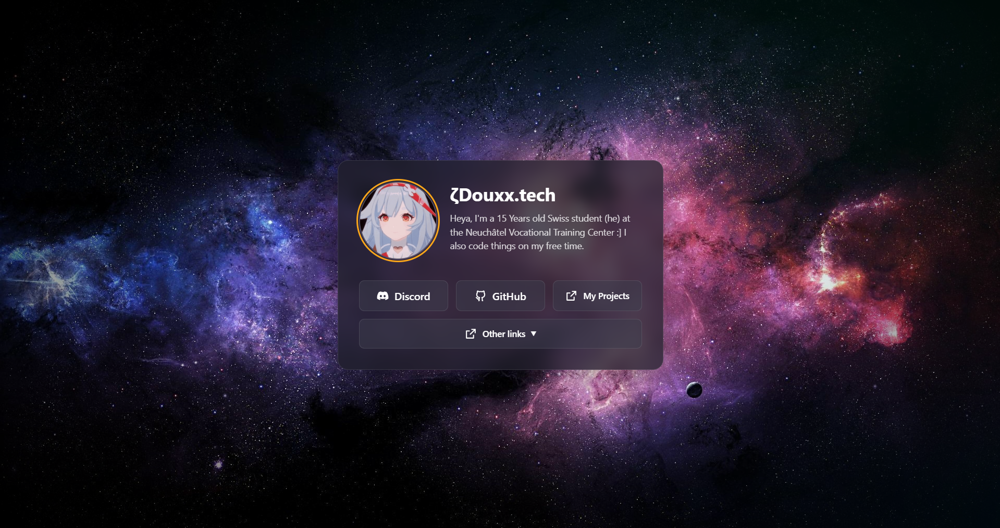

# Dynamic Profile Page



A dynamic, responsive profile page that integrates with Discord's Lanyard API to display real-time status, avatar, and username information. Perfect for personal websites, portfolios, or social media landing pages.

## Features

- 🎮 **Discord Integration**: Real-time status, avatar, and username via Lanyard API
- 🎨 **Customizable Design**: Space-themed background with nebula effects
- 🔗 **Social Links**: Support for multiple social media buttons
- 📱 **Responsive Design**: Works perfectly on all devices
- 🎯 **Dropdown Menus**: Group multiple links under dropdown buttons
- ⚡ **JavaScript Functions**: Execute custom JS functions from buttons
- 🔧 **Debug Mode**: Built-in debugging for Discord API integration
- 🌐 **SEO Optimized**: Rich embed support for social media sharing

## Requirements

- PHP 7.4 or higher
- Web server (Apache, Nginx, etc.)
- Internet connection for Discord API integration

## Installation

### Option 1: Traditional Web Hosting

1. **Download/Clone the repository**
   ```bash
   git clone https://github.com/douxxtech/douxx.tech
   cd douxx.tech
   ```

2. **Upload to your web server**
   - Upload all files to your web server's public directory (e.g., `public_html`, `www`, etc.)

3. **Configure permissions**
   ```bash
   chmod 644 config.json
   chmod 755 assets/
   ```

### Option 2: Local Development

1. **Using PHP's built-in server**
   ```bash
   php -S localhost:8000
   ```

2. **Using XAMPP/WAMP/MAMP**
   - Place files in the `htdocs` directory
   - Access via `http://localhost/your-folder-name`

## Configuration

Create a `config.json` file in the root directory with your settings:

```json
{
  "title": "Your Name - Profile",
  "name": "Your Display Name",
  "bio": "Your bio or description here",
  "profileImage": "assets/images/default-avatar.png",
  "backgroundImage": "assets/images/space-bg.jpg",
  "favicon": "assets/images/favicon.ico",
  
  "discord": {
    "enabled": true,
    "discordId": "123456789012345678",
    "showStatus": true,
    "useUsername": true,
    "useAvatar": true
  },
  
  "embed": {
    "title": "Your Name",
    "description": "Check out my profile and social links!",
    "author_name": "Your Name",
    "color": "#7289da",
    "image_url": "https://example.com/embed-image.png",
    "thumbnail_url": "https://example.com/thumbnail.png"
  },
  
  "buttons": [
    {
      "text": "GitHub",
      "url": "https://github.com/yourusername",
      "icon": "assets/icons/github.png"
    },
    {
      "text": "Twitter",
      "url": "https://twitter.com/yourusername",
      "icon": "assets/icons/twitter.png"
    },
    {
      "text": "Social Media",
      "dropdown": true,
      "id": "social",
      "icon": "assets/icons/social.png",
      "items": [
        {
          "text": "Instagram",
          "url": "https://instagram.com/yourusername",
          "icon": "assets/icons/instagram.png"
        },
        {
          "text": "TikTok",
          "url": "https://tiktok.com/@yourusername",
          "icon": "assets/icons/tiktok.png"
        }
      ]
    },
    {
      "text": "Contact Me",
      "jsFunction": "openContactModal",
      "icon": "assets/icons/contact.png"
    }
  ]
}
```

## Discord Integration Setup

### Step 1: Get Your Discord ID

1. Enable Developer Mode in Discord:
   - Go to Settings → Advanced → Enable Developer Mode
2. Right-click on your Discord profile
3. Select "Copy User ID"
4. Paste this ID in the `discordId` field in `config.json`

### Step 2: Set up Lanyard Bot

1. Join the [Lanyard Discord server](https://discord.gg/lanyard)
2. The bot will automatically track your presence
3. Test your integration by visiting: `https://api.lanyard.rest/v1/users/YOUR_DISCORD_ID`

### Configuration Options

| Option | Description | Default |
|--------|-------------|---------|
| `enabled` | Enable/disable Discord integration | `false` |
| `discordId` | Your Discord user ID | `""` |
| `showStatus` | Display online/offline/dnd/idle status | `true` |
| `useUsername` | Use Discord username instead of config name | `false` |
| `useAvatar` | Use Discord avatar instead of profile image | `false` |

## Button Types

### 1. Regular Link Button
```json
{
  "text": "GitHub",
  "url": "https://github.com/username",
  "icon": "assets/icons/github.png"
}
```

### 2. Dropdown Button
```json
{
  "text": "Social Media",
  "dropdown": true,
  "id": "social",
  "icon": "assets/icons/social.png",
  "items": [
    {
      "text": "Instagram",
      "url": "https://instagram.com/username",
      "icon": "assets/icons/instagram.png"
    }
  ]
}
```

### 3. JavaScript Function Button
```json
{
  "text": "Custom Action",
  "jsFunction": "myCustomFunction",
  "icon": "assets/icons/custom.png"
}
```

## Custom JavaScript

Add custom JavaScript files to the `morejs/` directory. They will be automatically loaded.

Example (`morejs/custom.js`):
```javascript
window.myCustomFunction = function () {
    alert('Custom function executed!');
}

window.openContactModal = function () {
    console.log('Opening contact modal...');
}
```

## Debugging

Add `?debug` to your URL to enable debug mode:
```
https://douxx.tech/?debug
```

This will show:
- Discord API response details
- JSON validation status
- Extracted Discord information
- Direct API testing links

## File Structure

```
discord-profile-page/
├── assets/
│   ├── css/
│   │   └── styles.css
│   ├── js/
│   │   └── script.js
│   ├── images/
│   │   ├── space-bg.jpg
│   │   └── default-avatar.png
│   └── icons/
│       └── (your social media icons)
├── morejs/
│   └── (additional JavaScript files)
├── config.json
├── index.php
└── README.md
```

## Customization

### Styling
- Edit `assets/css/styles.css` to customize the appearance
- The design includes space-themed backgrounds and nebula effects
- Fully responsive design with mobile optimization

### Images
- Place your profile image in `assets/images/`
- Add social media icons to `assets/icons/`
- Recommended icon size: 24x24px PNG format

### Background
- Replace `assets/images/space-bg.jpg` with your preferred background
- Supports any web-compatible image format

## Troubleshooting

### Discord Integration Not Working
1. Verify your Discord ID is correct
2. Ensure you've joined the [Lanyard Discord server](https://discord.gg/lanyard)
3. Check if the Lanyard API is accessible: `https://api.lanyard.rest/v1/users/YOUR_ID`
4. Use debug mode (`?debug`) to see detailed error information

### Common Issues
- **500 Error**: Check PHP error logs, ensure config.json is valid JSON
- **Images Not Loading**: Verify file paths and permissions
- **Buttons Not Working**: Check JavaScript console for errors

## License

This project is open source and available under the [GPL-3.0](LICENSE).

## Contributing

1. Fork the repository
2. Create a feature branch (`git checkout -b feature/amazing-feature`)
3. Commit your changes (`git commit -m 'Add some amazing feature'`)
4. Push to the branch (`git push origin feature/amazing-feature`)
5. Open a Pull Request

## Support

If you encounter any issues or have questions:
- Check the debug mode output
- Review the troubleshooting section
- Open an issue on this repo

<a align="center" href="https://github.com/douxxtech" target="_blank">
</img>
</a>
